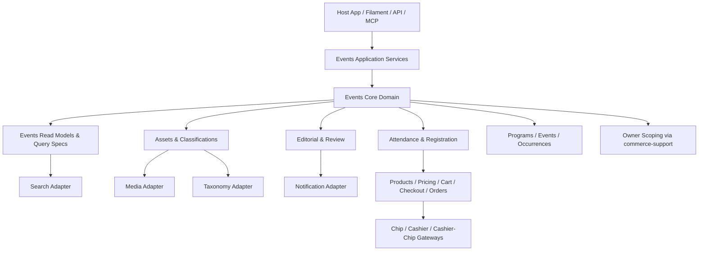

# `aiarmada/events` upgrade plan

## Executive summary

`commerce/packages/events` is already a solid generic event-lifecycle package, but today it is still closer to a **registrations + occurrences core** than a full **event platform foundation**.

`ilmu360` proves the missing shape clearly:

- richer editorial and moderation workflow
- first-class speaker, title, and topic change workflows
- deeper public discovery and search filters
- stronger media and taxonomy modeling
- more flexible people / organizer / venue relationships
- event-change announcement flows
- public submission and contribution flows
- attendance and engagement beyond “just registration”
- paid registration and native commerce / payment orchestration
- adapter seams for APIs, Filament, notifications, analytics, and AI / MCP tooling

The upgrade should **not** copy ilmu360 literally.

Instead, the package should absorb the **generic primitives** hidden inside ilmu360’s application-specific behavior, while keeping religion-specific, brand-specific, copy-specific, and workflow-specific decisions in the host app.

The target outcome is:

1. `aiarmada/events` becomes a strong owner-aware event domain package that can power:
   - commerce-attached ticketed events
   - public content-led events
   - moderated submission-driven event directories
   - program / series / session hierarchies
   - walk-in, free registration, paid registration, hybrid, and intent-based attendance
2. `aiarmada/filament-events` remains the admin adapter, not the domain owner.
3. host applications can plug in:
   - custom search engines
   - custom media systems
   - custom taxonomies
   - custom audience rules
   - custom schedule semantics such as prayer-relative timing
   - custom notifications, analytics, AI, and MCP tools

## Sources used for this plan

This plan is grounded in the current code, not theory.

### Current `commerce/packages/events` surface reviewed

- `packages/events/CONTEXT.md`
- `packages/events/docs/01-overview.md`
- `packages/events/docs/03-configuration.md`
- `packages/events/docs/04-usage.md`
- `packages/events/docs/05-invariants.md`
- `packages/events/src/Models/Event.php`
- `packages/events/src/Models/Occurrence.php`
- `packages/events/src/Services/RegistrationService.php`
- `packages/events/src/Actions/EnsureOccurrenceAction.php`
- `packages/events/src/Contracts/*`
- `packages/events/src/Enums/*`

### ilmu360 event domain reviewed

- `app/Models/Event.php`
- `app/Actions/Events/SubmitFrontendEventAction.php`
- `app/Actions/Events/RegisterForEventAction.php`
- `app/Actions/Events/RecordEventCheckInAction.php`
- `app/Actions/Events/PublishEventChangeAnnouncement.php`
- `app/Filament/Resources/Events/Schemas/EventForm.php`
- `app/Forms/EventContributionFormSchema.php`
- `app/Http/Controllers/Public/EventsController.php`
- `app/Http/Controllers/Api/Frontend/AdvancedEventController.php`
- `app/Support/Moderation/EventModerationWorkflow.php`
- `app/States/EventStatus/*`
- `app/Services/EventSearchService.php`
- `app/Services/Notifications/EventNotificationService.php`
- `app/Models/EventSubmission.php`
- `app/Models/EventChangeAnnouncement.php`
- representative event feature tests in `tests/Feature/*Event*.php`

## Audit corrections applied

This document has been audited against the current package and monorepo layout.

- The package **already has package-scoped automated coverage** in the monorepo test suite under `tests/src/Events` and `tests/src/FilamentEvents/Integration`. The plan now expands that suite instead of incorrectly proposing a brand-new local `packages/events/tests` convention.
- The current editorial state column is `moderation_status`. The recommended first implementation path is to **extend the existing `moderation_status` concept** rather than immediately introducing a second review-state column.
- Owner scoping already exists in the package, but it is **feature-flagged and default-off today**. Upgrade work should remain owner-safe regardless of whether a host enables owner enforcement.
- The package is currently **route-less by design**. That remains the correct boundary; HTTP controllers, Filament resources, MCP tools, and public UX should continue to live in adapter layers.

## ilmu360 relation audit conclusions

After re-auditing ilmu360’s `Event` model and its related records, the relation graph falls into three buckets.

### Strong core candidates

These look broadly reusable and worth baking into the shared package core:

- event hierarchy (`parentEvent`, `childEvents`)
- organizer and venue relationships (`organizer`, `venue`)
- scheduled attendance lifecycle (`registrations`, `checkins`)
- generic people roles (`keyPeople`, `people`)
- editorial workflow (`submissions`, moderation reviews)
- public change notices (`changeAnnouncements`)
- optional intent/engagement behavior (`savedBy`, `goingBy`)

### Extension-first candidates

These are useful, but not universal enough to force into first-wave shared schema:

- references / study materials (`references`, `bookReference`, `reference_study_subtitle`)
- collaboration graphs (`members`, `memberInvitations`)
- event reporting / abuse or moderation intake (`reports`)
- donation / fundraising links (`donationChannel`)
- nested location detail like institution-specific `space`
- auxiliary link collections like `mediaLinks` when a generic asset system exists

### Host-specific helpers that should stay out of core

- book-specific helpers
- prayer-relative vocabulary and labels
- institution/member authorization shortcuts
- app-specific display helpers and copy conventions

This audit reinforces the package direction:

- bake in the broad invariants
- keep rich extension seams for the rest
- do not force ilmu360’s full relation graph into the shared package

## Core vs optional shared module vs host extension matrix

This matrix is the decision filter for what should ship in `commerce/packages/events` itself.

### Detailed capability decision table

| Capability | Shared core | Optional shared module / later promotion | Host extension only | Notes |
| --- | --- | --- | --- | --- |
| `Event` + `Occurrence` split | Yes |  |  | Foundational package invariant |
| Event hierarchy (`parent_event_id`, `structure`) | Yes |  |  | Broadly reusable program/session model |
| Organizer relation | Yes |  |  | Generic morph or configurable relation |
| Venue relation | Yes |  |  | Broad reusable scheduling primitive |
| Occurrence schedule boundaries (`starts_at`, `ends_at`, timezone) | Yes |  |  | Core operational scheduling truth |
| Optional schedule metadata / resolver hooks | Yes |  |  | Core seam for host-defined timing semantics |
| Agenda / itinerary items |  | Yes |  | Common enough to plan for, but not mandatory for every host |
| Generic people roles / assignments | Yes |  |  | Broadly reusable if modeled with open keys |
| Speaker-specific helper relations for convenience | Yes |  |  | Fine as projections on top of generic people roles |
| Editorial submissions (`EventSubmission`) | Yes |  |  | Broadly reusable for moderated event workflows |
| Editorial reviews (`EventReview`) | Yes |  |  | Broadly reusable moderation primitive |
| Review reason codes | Yes, as configurable defaults |  |  | Keep configurable / extensible |
| Change notices / announcements | Yes |  |  | Broadly reusable public-update primitive |
| Structured changed-sections payloads | Yes |  |  | Needed for generic compound change workflows |
| Notification audience resolution for change notices | Yes, via contracts |  |  | Core behavior with host-defined audience policy |
| Package-fired domain events | Yes |  |  | Primary extension surface |
| After-commit notification / analytics hooks | Yes |  |  | Core delivery safety rule |
| Asset records (`EventAsset`) | Yes |  |  | Broadly reusable when role keys stay open |
| Asset role vocabulary |  | Yes | Yes | Defaults may ship, but host-defined roles must remain valid |
| Classification records (`EventClassification` / `EventTermAssignment`) | Yes |  |  | Broadly reusable if group/term keys stay open |
| Classification vocabulary |  | Yes | Yes | Registry/open-key driven, not hard-coded app taxonomy |
| Reference / source-material assignments |  | Yes | Yes | Extension-first now; promote only if clear cross-host demand emerges |
| Reference catalog ownership |  |  | Yes | Package should not own a universal reference library |
| Registrations | Yes |  |  | Core event lifecycle concern |
| Walk-ins | Yes |  |  | Core event attendance concern |
| Attendance / check-in records | Yes |  |  | Broadly reusable audit trail primitive |
| Waitlist / approval-ready registration support | Yes |  |  | Common enough to belong in package lifecycle |
| Paid registration / checkout integration | Yes |  |  | Broadly reusable inside Commerce ecosystem |
| Checkout / sellable mapping contracts | Yes |  |  | Needed to keep commerce flows extensible |
| Gateway-specific billing logic |  |  | Yes | Belongs to `chip`, `cashier`, `cashier-chip`, not events |
| Engagement (`saved`, `going`, `interested`) | Yes, but feature-flagged |  |  | Common enough to keep in package scope |
| Search criteria object | Yes |  |  | Needed for reusable adapter/query layer |
| Query / search service | Yes |  |  | Reusable discovery primitive |
| Read models / DTOs | Yes |  |  | Needed for adapters and API surfaces |
| Search engine integration details | Yes, via contracts |  |  | Core seam, host chooses engine behavior |
| Collaboration graphs / memberships / invitations |  |  | Yes | Organizational model varies too much by host |
| Reports / abuse / moderation intake extras |  |  | Yes | Better as host or extension concern |
| Donation / fundraising links |  |  | Yes | Not a universal event-core concern |
| Nested location concepts like institution spaces |  |  | Yes | Too host-shaped for first-wave core |
| Prayer-relative timing vocabulary |  |  | Yes | Support through scheduling hooks, not shared vocabulary |
| Institution/member authorization shortcuts |  |  | Yes | Host authorization concern |
| AI image prompts / MCP tools / app-specific automation |  |  | Yes | Keep outside shared core |
| App-specific analytics taxonomy |  |  | Yes | Hosts should define their own tracking language |

### Interpretation rule

The package upgrade should follow this matrix strictly:

- if a capability is marked **Shared core**, it should be implemented as a stable package primitive
- if a capability is marked **Optional shared module / later promotion**, prefer hooks, contracts, metadata, and extension tables first; only promote it into shared schema after broader demand is proven
- if a capability is marked **Host extension only**, do not bake it into shared-core schema or required package contracts

## Current-state assessment

## What the package already does well

The current package is already strong in these areas:

- owner-aware event records with optional owner enforcement
- reusable `Event` + `Occurrence` split
- venue modeling
- ordered event people
- public visibility and publication windows
- registration and walk-in lifecycle
- capacity checks
- check-in lifecycle
- order / customer / product / variant integration
- idempotent upsert flow via `EnsureOccurrenceAction`
- extension seams for search payloads, display timezone, and order fulfillment

Those strengths make the package a good base for native paid registration; the upgrade should extend them into a full checkout-aware flow rather than replacing them.

## What the package is still missing

Compared with ilmu360, the current package is still thin in seven major areas:

1. **Editorial domain**
   - submissions
   - moderation reviews
   - reason codes
   - reconsideration / remoderation
   - contributor-facing workflows

2. **Public content richness**
   - first-class structured people roles
   - richer program / parent-child hierarchy
   - structured change notices and replacement-event flows
   - first-class workflows for speaker changes and title / topic changes

3. **Discovery primitives**
   - a formal search criteria API
   - first-class filterable classifications
   - generic audience and schedule metadata that search can understand

4. **Asset and classification modeling**
   - JSON-only `media_references` and `taxonomy` are useful seams, but too weak as the long-term truth when apps need robust filtering, ordering, and admin tooling
   - no first-class source-material / reference-assignment model yet for books, readings, source links, or host-owned reference records tied to an event

5. **Attendance beyond registration**
   - bookmarks / going / interest states
   - separate attendance records / check-ins for non-registration flows
   - duplicate and eligibility strategies more flexible than current defaults

6. **Platform seams**
   - no first-class package-level query / DTO / workflow contracts for API, Filament, public web, analytics, and MCP consumers

7. **Paid registration and native commerce monetization**
   - no checkout-native paid registration path yet
   - no package-owned strategy for turning paid seat intent into cart / checkout / order flows
   - no explicit refund / failed-payment / cancelled-order synchronization plan back into registrations and attendance
   - no documented native path for installed payment backends such as `aiarmada/chip`, `aiarmada/cashier`, or `aiarmada/cashier-chip`

## Core design decision

## Do **not** collapse back to ilmu360’s single-record event shape

The package should **keep** the distinction between:

- **Event** = reusable content / identity / publication object
- **Occurrence** = scheduled operational instance

That split is more generic and more durable than ilmu360’s current “event is also the attendable session” design.

To replace ilmu360 successfully, the package should grow upward from this stronger model instead of downgrading to the app-specific one.

The right move is:

- preserve `Event` + `Occurrence`
- make `Event` capable of representing standalone sessions, parent programs, and reusable templates
- make `Occurrence` the operational truth for attendance, capacity, registration, and check-in
- add a compatibility layer so host apps that think in “single event records” can still work comfortably

## Upgrade goals

The upgraded package should become:

- **generic** — not tied to Islamic event language, Malay copy, prayer vocabulary, or one application’s UX
- **rich enough** to replace ilmu360’s event backbone
- **modular** — host apps opt into richer features without being forced into one editorial model
- **queryable** — core features must be represented in a way that supports filtering, search, admin tooling, and APIs
- **multi-tenant safe** — owner scoping remains first-class
- **adapter-friendly** — media, taxonomy, notifications, analytics, AI, search, and UI stay pluggable

## Non-goals

The package should **not** own these directly:

- application-specific public copy
- localized UI wording
- brand or SEO strategy
- geolocation permission UX
- prayer tables or religious calendars as hard-coded package rules
- Typesense-only search tuning
- MCP prompts, AI generation prompts, or app-specific tool definitions
- share-tracking outcome names or app analytics taxonomies

These belong in the host app or in adjacent adapter packages.

## Genericity and extensibility guardrails

To keep the package truly reusable, the implementation should follow these non-negotiable rules.

### 1. Prefer registries and string keys over app-shaped enums

For vocabularies that vary heavily between applications, the package should prefer:

- stable string keys stored in the database
- registry / resolver contracts for labels, icons, UI hints, and behavior
- optional package-provided defaults, but not hard-coded app vocabulary as the only supported path

This applies especially to:

- people roles
- asset roles / kinds
- classification groups and terms
- reference kinds
- change / notice kinds
- notification audience categories

The package may ship built-in defaults, but hosts must be able to extend or replace them.

### 2. Keep queryable concerns first-class, push app-specific detail into metadata

Use a two-layer model:

- **first-class columns / relations** for data that must be filtered, sorted, validated, or indexed
- **metadata bags** for host-specific or experimental data that should not force schema churn

Rule of thumb:

- if the package needs to filter on it, it should not live only in opaque JSON
- if only the host app cares about it, metadata is often the right home

### 3. Use domain events for passive hooks, contracts for active decisions

The extension strategy should be:

- **domain events** when hosts need to react after something happened
- **contracts / policies / resolvers** when the package needs the host to decide behavior

Examples:

- publish change notice → dispatch a domain event
- choose notification audience → use a resolver contract
- compute display timezone → use a resolver contract
- map checkout sellable → use a resolver / integration contract

### 4. Do not hard-code one application's language into persistence

The package must avoid storing assumptions like:

- Malay / English UI labels as required persistence fields
- religion-specific classification names
- app-specific role names
- app-specific change labels

Persistence should store neutral keys and structured payloads; host adapters can localize or decorate them.

### 5. Built-in defaults must be optional, not mandatory

Where the package ships built-in change kinds, role keys, asset roles, or billing modes, those should be treated as:

- helpful defaults
- good interoperability anchors
- not the only allowed values

Custom host-defined keys should remain possible without forking the package.

### 6. Creative host use cases should feel native

The package should be able to support creative hosts such as:

- content-driven event directories
- ticketed commercial events
- educational cohorts and programs
- worship / community events
- invite-only private gatherings
- hybrid event/media publication workflows

That means the core must stay open-ended in vocabulary while remaining strict in invariants.

## Target architecture



The package should evolve into seven internal modules.

### 1. Program and schedule graph

This is the structural backbone.

#### Keep

- `EventSeries`
- `Event`
- `Occurrence`
- `Venue`

#### Add / evolve

- `Event` hierarchy support:
  - `parent_event_id` nullable
  - `structure` or `kind` enum/string such as:
    - `standalone`
    - `program`
    - `session`
    - `template`
- `Occurrence` remains the attendable schedule record
- optional schedule metadata for recurring or derived timing
- optional itinerary / agenda support for occurrences that need ordered timed segments

#### Why

This covers:

- commerce-style ticketed sessions
- parent-program and child-session hierarchies
- future recurring or imported schedules
- optional public agendas and internal run-of-show extensions

without forcing a one-size-fits-all public model.

#### Itinerary / agenda support

Yes — itinerary or agenda support is common enough that the package should plan for it.

However, it should be modeled as an **optional generic schedule-detail layer**, not a mandatory assumption for every event.

Recommended shape:

- support an optional ordered child model such as `OccurrenceAgendaItem` or `EventAgendaItem`
- scope it to `Occurrence` by default, because itinerary is usually specific to one scheduled run
- use neutral fields such as:
   - `starts_at`
   - `ends_at`
   - `label`
   - `description`
   - `role_key` or `segment_type`
   - `person_type` / `person_id` nullable
   - `location_label`
   - `order_column`
   - `metadata`

This should support both:

- public agendas shown to attendees
- internal run sheets or programme segments for host apps that need them

Not every host will need itinerary support, but when they do, the package should make it feel native.

### 2. People and relationship graph

The package should stop being speaker-specific.

#### Current limitation

`EventPerson` is too narrow for apps that need:

- moderators
- hosts
- facilitators
- person in charge
- imam / khatib / bilal
- external guest names without linked profiles

#### Proposed upgrade

Replace or supersede `EventPerson` with a more generic model, for example:

- `EventPerson`
- or `EventRoleAssignment`

with fields such as:

- `event_id`
- `person_type` / `person_id` morph
- `display_name`
- `role_key`
- `role_label`
- `is_public`
- `order_column`
- `metadata`

#### Design rule

- `speaker` becomes just one role, not the model name
- apps may point to a host `Speaker`, `User`, `InstitutionMember`, or any morphable identity
- display-only names remain supported

This is the generic shape for richer event people-role graphs without hard-coding one application’s role vocabulary.

### 3. Editorial workflow module

This is the biggest missing capability if the package is meant to replace ilmu360’s current event backbone.

#### Add package-owned generic models

- `EventSubmission`
- `EventReview`
- optional `EventReviewReason` config or enum-backed reason codes

#### Add actions / services

- `SubmitEventForReviewAction`
- `ApproveEventAction`
- `RequestEventChangesAction`
- `RejectEventAction`
- `CancelEventAction`
- `ReconsiderEventAction`
- `RevertEventToDraftAction`
- `RemoderateEventAction`

#### Add workflow policy service

The package should expose a workflow definition service, for example:

- `EventReviewWorkflow`

This should answer:

- current allowed actions
- required fields for an action
- transition guards
- side effects

#### Important design choice

Do **not** hard-code ilmu360’s role names or public copy.

The package should provide:

- transition keys
- state transition rules
- structured reason codes
- contracts for notifications and audit hooks

The host app or Filament adapter can decide labels, icons, copy, and who may execute actions.

#### States

Keep lifecycle `status` and review `moderation_status` separate.

Recommended first-wave approach:

- keep `status` as the lifecycle column, extending it only if the package truly needs a lifecycle-level `cancelled` state
- extend `moderation_status` beyond the current `pending`, `approved`, and `rejected` values to support review outcomes such as `changes_requested`

Suggested near-term shape:

- `status`: `draft`, `active`, `archived`, and possibly `cancelled` if cancellation becomes a lifecycle concern rather than only a published change notice
- `moderation_status`: `pending`, `changes_requested`, `approved`, `rejected`

Only introduce a separate `review_status` column if a later implementation spike proves that submission state and moderation state cannot be represented cleanly by the existing split.

### 4. Assets, classifications, and reference graph module

The package needs richer generic truth than JSON blobs.

#### Current limitation

- `media_references` is too weak for ordered assets, roles, and adapter syncing
- `taxonomy` is too weak for first-class filtering and validation
- the package still lacks a first-class model for event content references / source materials

#### Proposed upgrade

Introduce first-class generic relational models while keeping JSON caching / adapter seams.

##### Assets

Add `EventAsset` with fields like:

- `event_id` or `occurrence_id`
- `role_key`
- `provider`
- `provider_reference`
- `url`
- `title`
- `alt_text`
- `order_column`
- `metadata`

`role_key` should be a stable string key, with package defaults allowed but host-defined roles supported. Example defaults might include `hero_image`, `share_image`, `gallery_item`, or `attachment`, but the package should not force one application's asset vocabulary.

This lets the package support:

- plain URLs
- host-managed uploads
- Spatie Media Library adapters
- AI-generated images

without hard dependency on one storage system.

##### Classifications

Add `EventClassification` or `EventTermAssignment` with fields like:

- `event_id`
- `group_key`
- `term_key`
- `term_label`
- `source_type` / `source_id` nullable
- `order_column`
- `metadata`

This replaces taxonomy JSON as the queryable truth.

#### Why this matters

This model lets host applications express their own classification systems using stable keys instead of package-owned vocabulary.

Examples a host might choose to model include:

- event type
- topic
- audience
- language
- format
- genre
- difficulty level
- source tradition
- creative custom taxonomies

The important part is that the package stores and queries them generically, without owning the host's semantic dictionary.

##### References and source materials

After the deeper relation audit, this should be treated as an **extension-first surface**, not mandatory first-wave core schema.

Recommended default approach:

- let host applications or follow-on extension packages own reference-assignment tables when they need them
- let the core package expose enough metadata, changed-sections payloads, search hooks, and domain events to make those extensions feel native

Only if broad cross-host demand is proven should the shared package add a table such as `EventReferenceAssignment` with fields like:

- `event_id`
- `reference_type` / `reference_id` morph nullable
- `reference_kind`
- `display_label`
- `url`
- `order_column`
- `metadata`

If that path is ever taken, `reference_kind` should remain a host-extensible key rather than a rigid package enum.

The package does **not** need to own a universal reference catalog. The core requirement is simply that reference-like extensions can hook into the package cleanly.

### 5. Attendance, registration, and engagement module

The current package is good at registrations, but it still needs to broaden.

#### Keep

- `Registration`
- `RegistrationService`
- capacity enforcement
- walk-ins
- order fulfillment integration

#### Upgrade

##### A. attendance records

Add a separate `AttendanceRecord` or `CheckInRecord` model.

Why:

- supports walk-ins without pretending every attendance action is a registration state
- supports repeat scans, audit trails, source channels, and staff-driven check-ins
- maps more cleanly to ilmu360’s separate `EventCheckin`

##### B. duplicate strategy policy

Support configurable duplicate-prevention policies, for example:

- per occurrence + attendee
- per event + attendee
- per series + attendee
- none

##### C. waitlist and approval support

Add optional policy-driven support for:

- waitlisted registrations
- approval-required registrations
- manual confirmation

##### D. engagement signals

Add an optional generic engagement layer.

Suggested model:

- `EventEngagement`

with types like:

- `saved`
- `going`
- `interested`

This should be opt-in, but package-owned.

It is too common to keep re-implementing per app, and ilmu360 already proves the need.

### 6. Paid registration and commerce-native payment module

The package already has the beginnings of this through:

- `product_id` / `variant_id` links on `Occurrence`
- `order_id` / `order_item_id` links on `Registration`
- `EventOrderItemFulfillmentResolver`

The upgrade should turn those seams into a complete native flow for paid event registrations.

#### Native package integration path

When installed together, the package should integrate natively with:

- `aiarmada/products` for sellable occurrence-linked products and variants
- `aiarmada/pricing` for resolved seat / ticket pricing rules
- `aiarmada/cart` for basket-based seat purchase flows
- `aiarmada/checkout` as the default orchestration path for paid registrations
- `aiarmada/orders` as the source of truth for payment, refund, and order-item lifecycle
- `aiarmada/chip`, `aiarmada/cashier`, and `aiarmada/cashier-chip` as installed payment backends behind checkout or billing flows

#### Design rule

The default native orchestration path should be **checkout-first**, not gateway-first.

- `checkout` owns cart-to-order orchestration
- `orders` owns payment / refund records and lifecycle
- `chip`, `cashier`, and `cashier-chip` own gateway-specific billing behavior
- `events` owns how paid event intent becomes seats, registrations, attendance entitlements, and event-specific fulfillment state

Direct gateway shortcuts should remain opt-in adapters for hosts that intentionally bypass the standard checkout flow.

#### Required package capabilities

- free and paid registration modes at the occurrence level
- package-native conversion of an occurrence seat into a sellable cart / checkout payload
- pending-payment hold semantics when seats should be reserved during checkout
- confirmation sync when order payment succeeds
- failure / expiration sync when checkout fails or seat holds expire
- refund / cancellation sync back into registration and attendance state
- native support for one-off payment flows, with recurring billing support remaining optional and adapter-driven

#### Why this matters

This is the correct generic evolution of the package’s current registration seam.

Some hosts only need free registrations.
Others need paid tickets, paid programs, or checkout bundles mixing events with non-event items.

The package should handle both cleanly when companion Commerce packages are installed.

### 7. Agenda and itinerary module

This should be an optional schedule-detail layer for events that need more than a single start/end boundary.

#### Why it belongs in the roadmap

Many event products eventually need one or more of these:

- public agendas / itineraries
- programme segments
- breakout schedules
- internal run sheets
- speaker-by-segment timelines

That is broad enough to deserve a place in the package plan.

#### Design rule

This should remain optional and generic:

- not every event needs itinerary items
- the package should not assume one vocabulary for programme items
- hosts should be able to decorate agenda items with metadata, linked people, assets, and custom segment keys

#### Suggested shape

- optional `OccurrenceAgendaItem` relation owned by `Occurrence`
- open string keys for segment / role types
- domain events for agenda item created / updated / removed when hosts need projections, notifications, or search updates

This is worth planning for, but only if it remains optional and extension-friendly.

## Generic replacement mapping from ilmu360

| ilmu360 concept | Package target | Should become core? | Notes |
| --- | --- | --- | --- |
| `EventKeyPerson` roles | generic event people / role assignments | Yes | Do not keep speaker-only naming |
| parent program / child events | event hierarchy + occurrences | Yes | Generic program/session support |
| event submission records | `EventSubmission` module | Yes | Generic contributor workflow |
| moderation reviews and transitions | review workflow module | Yes | Generic, configurable labels |
| speaker change workflow | change notice + notification module | Yes | Must be first-class, not hidden behind a generic fallback |
| title / topic change workflow | change notice + notification module | Yes | Must support audience notifications, not only audit storage |
| change announcements | change notice module | Yes | Broadly useful across event apps |
| cover/poster/gallery | asset module | Yes | Asset kinds should be generic |
| references / source materials | extension seam first, optional assignment module later | Probably not core-first | Support through metadata, hooks, changed sections, and optional extension tables |
| domain / discipline / source / issue tags | classification module | Yes | Keep package generic by using group keys |
| age group / gender / language filters | classifications + audience policy | Yes | Avoid hard-coded app enums in core |
| prayer-relative timing | schedule strategy adapter | Yes, as abstraction | Not as prayer-specific package logic |
| save / going | engagement module | Yes, opt-in | Generic behavioral interest |
| paid registrations and checkout flows | native commerce integration module | Yes | Checkout-first orchestration across installed Commerce packages |
| event search service | query spec + search adapter | Yes | Not Typesense-specific |
| Scramble / API controllers | host adapter | No | Package should expose services / DTOs instead |
| MCP tools / image prompts | host adapter | No | Keep AI integration outside core package |
| Malay labels / copy | host adapter | No | Translation layer stays app-side |

## Proposed new package contracts

The package should grow several contracts so adapters stay clean.

### Existing contracts to keep

- `EventSearchPayloadResolver`
- `EventDisplayTimezoneResolver`
- `EventOrderItemFulfillmentResolver`

### New contracts to add

- `EventReviewWorkflowContract`
- `EventReviewNotifierContract`
- `EventAssetRepositoryContract` or `EventAssetAdapterContract`
- `EventClassificationProviderContract`
- `EventReferenceAssignmentContract` or `EventReferenceAdapterContract`
- `EventContentDecoratorContract`
- `EventSearchEngineContract`
- `EventScheduleResolverContract`
- `EventEngagementPolicyContract`
- `EventDuplicateRegistrationPolicyContract`
- `EventAudiencePolicyContract`
- `EventChangeNoticeNotifierContract`
- `EventChangeNoticeAudienceResolverContract`
- `EventSellableResolverContract`
- `EventCheckoutIntegrationContract`
- `EventPaidRegistrationPolicyContract`
- `EventRefundSynchronizationContract`
- `EventPublicAccessPolicyContract`

The principle is simple:

- core domain owns invariants
- contracts own app-specific integration behavior

## Proposed data model changes

## Preserve existing tables where possible

Keep current tables and extend rather than rewrite blindly:

- `event_series`
- `events`
- `event_venues`
- `event_occurrences`
- `event_registrations`

## Add tables

Recommended additions:

- `event_people`
- `event_submissions`
- `event_reviews`
- `event_assets`
- `event_classifications`
- `event_change_notices`
- `event_attendance_records`
- `event_engagements`

Potential extension table if broad cross-host demand proves it belongs in shared schema:

- `event_reference_assignments`

## Candidate column additions

### `events`

- `parent_event_id`
- `structure`
- expanded `moderation_status`
- optional lifecycle cancellation fields such as `cancelled_at` if cancellation becomes a first-class lifecycle concept
- `audience_policy` JSON
- `schedule_metadata` JSON
- `content_metadata` JSON

### `event_occurrences`

- `slug` or public key if direct occurrence URLs are needed
- `schedule_mode`
- `schedule_reference_key`
- `schedule_reference_payload`
- `availability_policy`
- `registration_billing_mode`
- `seat_hold_ttl_minutes`
- `checkout_metadata`

Potential optional extension table if shared itinerary support is implemented:

- `event_occurrence_agenda_items`

### `event_registrations`

- continue using existing `order_id` / `order_item_id` as first-class commerce links
- `approval_status`
- `source_channel`
- `duplicate_scope_key`
- `reserved_until`
- `payment_state_projection`
- `waitlist_position`

## Important migration rule

Existing JSON columns should not vanish immediately.

Instead:

1. add relational truth tables
2. backfill from current JSON
3. dual-read for a transition period
4. then deprecate JSON-only workflows

## Search and discovery plan

The package should own discovery primitives, not just raw Eloquent scopes.

## Add a package query object

Create a first-class search criteria DTO / data object, for example:

- `EventSearchCriteria`

It should support generic filters like:

- text query
- event / occurrence state
- visibility
- publication window
- starts after / before / on
- organizer ids
- venue ids
- classification filters by group and term
- optional reference filters by linked record, kind, or source label when a host or extension projects them into the query model
- people filters by role and id
- location filters
- attendance mode
- registration availability
- audience policy flags

## Add a query / search service

Create a package-owned service such as:

- `EventQueryService`
- `EventSearchService`

The service should:

- build canonical Eloquent queries
- optionally delegate to Scout / external search
- return stable read models or paginated results

## Keep app-specific filters out of core

Examples:

- “Selepas Maghrib” should not be a core package filter
- instead, host apps can map that label to generic schedule metadata or classification filters

## Editorial workflow plan

### Review states

The package should support a canonical review lifecycle:

- `draft`
- `pending_review`
- `changes_requested`
- `approved`
- `rejected`

### Allowed transitions

- draft → pending_review
- changes_requested → pending_review
- pending_review → approved
- pending_review → changes_requested
- pending_review → rejected
- approved → pending_review
- rejected → pending_review
- rejected / changes_requested / approved → draft when explicitly reverted

### Required review artifacts

Every transition that matters should record:

- actor
- action key
- note
- reason code when required
- before state
- after state
- timestamps

This should live in `event_reviews`, not only notifications or audit logs.

## Change notice plan

This should be a first-class generic feature.

### Add a generic model

- `EventChangeNotice`

### Support generic notice types

Prefer a string-backed `change_key` with built-in defaults rather than a rigid application-shaped enum. The package may document recommended built-in keys such as:

- `schedule_changed`
- `location_changed`
- `speaker_changed`
- `title_changed`
- `topic_changed`
- `people_changed`
- `organizer_changed`
- `content_changed`
- `cancelled`
- `postponed`
- `replacement_linked`
- `other`

Hosts should still be able to introduce their own `change_key` values when the built-ins are not expressive enough.

### Support severity

- `info`
- `high`
- `urgent`

### Support notice behavior

- published / retracted state
- optional replacement event or replacement occurrence link
- before / after snapshots
- notification audience hooks
- structured change bundles so one notice can represent a coordinated editorial update across multiple event surfaces

This is one of the strongest generic insights from ilmu360 and absolutely belongs in the package.

### Common first-class change workflows

The package should explicitly support these as common workflows, not edge cases:

- main speaker changed
- speaker lineup changed
- event title changed
- event topic / content focus changed

These workflows should also support the reality that the primary change often carries dependent updates such as:

- updated classifications / tags surrounding the new topic
- updated source references / reading list
- updated cover, poster, or gallery assets
- updated summary / description or content metadata

These should not be forced into an `other` bucket or be treated as purely internal audit details.

### Compound editorial change sets

The package should support a single change workflow that can bundle together:

- people changes
- title / topic changes
- classification changes
- reference changes
- asset changes

Examples from ilmu360 that should be representable generically:

- speaker changed, so the cover image and poster are refreshed
- topic changed, so discipline / issue / source tags change too
- title changed, so references and supporting materials are updated together

This means `EventChangeNotice` should carry structured changed sections, not just a flat type and note.

Suggested shape:

- `change_key` — top-level category for the overall change
- `changed_sections` — structured list / map such as `people`, `headline`, `classifications`, `references`, `assets`, `content`, `schedule`, `custom`
- `before_snapshot` / `after_snapshot` — coarse snapshots
- `metadata` — host-defined extra context

This balances queryability with extensibility.

### Notification expectations for change workflows

Speaker, title, and topic changes should participate in the same notification system as cancellations and postponements.

The package should support audience-aware change notifications for at least:

- registered attendees
- waitlisted attendees
- paid purchasers and participant-linked order fulfillments
- optionally, saved / going / interested users when the host enables that behavior

Notifications for these compound editorial changes should be able to communicate that multiple related surfaces changed, for example:

- speaker + topic changed
- topic + tags + references changed
- title + cover image changed

Notification delivery should be adapter-driven, commit-safe, and capable of immediate or digest-style strategies chosen by the host application.

## Scheduling plan

The package should support richer scheduling without hard-coding one app’s religious calendar.

## Core rule

`Occurrence.starts_at` and `Occurrence.ends_at` remain the final materialized truth.

## Add schedule semantics as metadata plus resolver contracts

Suggested generic fields:

- `schedule_mode`
- `schedule_reference_key`
- `schedule_reference_payload`
- `schedule_label`

Examples of host-side implementations:

- prayer-relative timing
- “doors open 30 minutes after venue opening”
- imported calendar reference
- recurring template realization

This gives host applications the scheduling extension seam they need without baking any one domain’s timing vocabulary into the package.

## Media plan

The package should not depend directly on Spatie Media Library, but it should become much easier to integrate.

## Required upgrades

- first-class package asset model
- asset kinds instead of hard-coded app assumptions
- adapter contract for upload-backed systems
- ability to associate assets with `Event` and `Occurrence`
- ordering, labels, alt text, metadata, and public/private visibility support

## What stays outside core

- exact aspect ratios like ilmu360’s `cover` 16:9 and `poster` 4:5
- AI prompt generation
- MCP upload tools

Those should be host or adapter concerns layered on top of generic asset kinds.

## Engagement plan

The package should add optional event engagement primitives.

### Why

Registrations alone do not cover:

- saved searches and saved events
- “I’m going” without formal registration
- interest tracking for public directories

### Proposed model

- `EventEngagement`

with fields:

- `event_id` or `occurrence_id`
- `actor_type` / `actor_id`
- `type`
- `metadata`
- timestamps

### Suggested initial types

- `saved`
- `going`
- `interested`

This keeps the package strong enough for content-led event apps without forcing full ticketed registration for every intent signal.

## Paid registration and payment integration plan

The package should treat paid registrations as a native capability when the right Commerce packages are installed.

### Native integration stack

- `aiarmada/products` provides the product / variant catalog links for seats, passes, or program access
- `aiarmada/pricing` provides price resolution for those sellable records
- `aiarmada/cart` stores cart state when the customer is buying one or more seats
- `aiarmada/checkout` orchestrates checkout, payment handoff, and order creation
- `aiarmada/orders` stores payments, refunds, and order-item lifecycle
- `aiarmada/chip`, `aiarmada/cashier`, and `aiarmada/cashier-chip` provide the installed payment backends used by checkout or billing abstractions

### Native event-package responsibilities

The event package should own:

- deciding whether an occurrence is free, paid, hybrid, or host-managed
- mapping an occurrence seat into sellable checkout intent
- creating provisional or pending-payment seat holds where appropriate
- confirming registrations from successful order fulfillment
- synchronizing refunds, cancellations, and failed / expired checkout flows back into registration state
- preserving owner-safe resolution of related products, variants, customers, carts, checkouts, and orders

### Native helper surfaces to add

Examples of package-native flows the upgrade should include:

- `CreateOccurrenceCartLineAction`
- `StartOccurrenceCheckoutAction`
- `ConfirmRegistrationFromOrderAction`
- `SyncRegistrationRefundAction`
- `ReleaseExpiredSeatHoldAction`

These names are directional rather than final, but the workflow itself should be first-class in the package.

### Pricing and checkout extension rule

The package should not assume that every host uses the same pricing strategy, seat-hold rules, or checkout composition.

Use contracts and metadata so hosts can customize:

- what product / variant represents a seat
- whether quantity means seats, bundles, or cohort access
- how long a pending-payment hold lasts
- whether a paid registration is immediate, delayed, or manually confirmed
- whether refunds reopen seats, waitlists, or future availability

### Boundary rule

`events` should not become a payment-gateway package.

Instead, it should integrate naturally with the Commerce stack:

- product and price context from catalog packages
- checkout orchestration from `checkout`
- payment and refund truth from `orders`
- gateway implementation from `chip`, `cashier`, or `cashier-chip`

## Event firing, hooks, notifications, and analytics plan

The package should lean heavily on domain-event firing and commit-safe subscribers as the default extension mechanism.

The package should emit domain events and optional notifier contracts, not app-specific notification copy.

### Event firing should be a primary extension surface

Yes — this plan should use event firing more, and more deliberately.

The extension hierarchy should generally be:

1. **domain events** for passive extension and projections
2. **resolver / policy contracts** for active decisions the package needs the host to make
3. **metadata and read-model decoration** for host-specific detail

This keeps core logic stable while still making the package highly extensible.

### Event firing rules

- fire domain events after meaningful lifecycle changes
- prefer after-commit dispatch, after-commit listeners, or other commit-safe patterns for anything that can trigger notifications, analytics, projections, or external side effects
- keep event payloads structured and generic
- include changed sections or metadata summaries where useful, so host listeners do not need to diff large model graphs blindly

### Good uses for package-fired events

- notifications
- analytics and tracking
- search reindex triggers
- cache invalidation
- projection updates
- optional extension tables owned by the host app
- async enrichment or decoration

## Package-owned domain events should expand to include

- review submitted
- review approved
- review changes requested
- review rejected
- speaker changed notice published
- title changed notice published
- topic changed notice published
- change notice published
- event content changed with structured changed sections
- attendance intent recorded
- paid registration checkout started
- paid registration confirmed from order fulfillment
- paid registration refunded / released
- occurrence availability opened / closed

## Host app responsibilities

The host app decides:

- which notifications to send
- which analytics events to record
- which copy, locale, and channels to use
- how to wire Signals / custom trackers / AI tools

## API and admin adapter plan

The core package should stay route-less.

But it should expose stable building blocks for adapters.

## Add package DTOs / data objects for:

- event detail read model
- occurrence detail read model
- search result cards
- review schema
- change notice payload
- change bundle / changed-sections payload
- registration status payload

These DTOs should be package-neutral and avoid embedding host-specific labels or assumptions.

These become the shared language for:

- `filament-events`
- REST API controllers
- mobile API resources
- MCP tools
- background jobs

## Package-only implementation checklist (`commerce/packages/events`)

The phases in this section are for the shared `commerce/packages/events` package only.

They must not be treated as the same phases as:

- downstream package upgrades such as `aiarmada/filament-events`
- host-application adoption work such as `ilmu360`

Those downstream tracks come later and are intentionally separated below.

### Phase 0 — scope lock and architecture guardrails

#### Checklist

- [x] Confirm the package / host-app boundary in writing:
   - core package owns domain models, actions, services, contracts, migrations, invariants
   - host apps own HTTP controllers, public UX, Filament panel wiring, notifications copy, analytics vocabulary, MCP tools, and app-specific search tuning
- [x] Confirm the first-wave upgrade will preserve the `Event` + `Occurrence` split.
- [x] Confirm the first-wave editorial plan will extend `moderation_status` before introducing any new review-state column.
- [x] Confirm the package will use registry-backed string keys, not app-shaped enums, for highly variable vocabularies such as roles, asset roles, classification groups, reference kinds, and change kinds.
- [x] Remove the legacy people compatibility facade and use the generic people model exclusively.
- [x] Decide whether cancellation should remain primarily a change-notice concept, or also become a first-class lifecycle state on `Event` and / or `Occurrence`.
- [x] Decide whether optional itinerary / agenda support should land as:
   - a shared-core `OccurrenceAgendaItem` capability
   - or an extension-first module that can be promoted later if demand is broad enough
- [x] Confirm test locations stay aligned with monorepo convention:
   - `tests/src/Events`
   - `tests/src/FilamentEvents/Integration`
- [x] Record any architecture decisions that materially affect public package contracts before implementation starts.

#### Exit criteria

- [x] No unresolved ambiguity remains around package-vs-host ownership.
- [x] The first-wave schema direction is agreed.
- [x] The upgrade can proceed without re-litigating core boundaries mid-implementation.

### Phase 1 — strengthen the event graph foundation

#### Checklist

- [x] Add event hierarchy support to `Event`:
   - `parent_event_id`
   - `structure` / `kind`
- [x] Backfill existing events to a default structure such as `standalone`.
- [x] Update `EnsureOccurrenceAction` to support parent program / session graph creation without breaking current upsert behavior.
- [x] Keep `Occurrence` as the attendable, operational schedule record.
- [x] Add any required indexes for hierarchy traversal and structure filtering.
- [x] Add or update scopes / query helpers for:
   - root programs
   - child sessions
   - standalone events
- [x] If itinerary support is in scope for the first implementation wave, define its ownership and relation shape at the occurrence layer.
- [x] Add coverage in `tests/src/Events` for hierarchy creation and querying.
- [x] Update package docs to explain the upgraded event graph.

#### Exit criteria

- [x] Existing occurrence, registration, and fulfillment behavior still passes.
- [x] Hierarchy queries are test-covered.
- [x] No current consumer is forced to adopt parent-child events immediately.

### Phase 2 — replace speaker-only modeling with generic people roles

#### Checklist

- [x] Introduce a generic people / role-assignment model, e.g. `EventPerson` or `EventRoleAssignment`.
- [x] Support morph-linked identities plus display-only names in the new model.
- [x] Add first-class role fields:
   - `role_key`
   - optional `role_label`
   - `is_public`
   - `order_column`
- [x] Preserve ordered people output semantics during the migration.
- [x] Remove the legacy people compatibility facade entirely.
- [x] Update `EnsureOccurrenceAction` and search payload generation to consume the new role-assignment model.
- [x] Add role-focused query helpers and filterability for future search / admin adapters.
- [x] Add tests for:
   - linked identities
   - display-only people
   - ordering
   - multiple role types
   - no compatibility facade

#### Exit criteria

- [x] People use cases continue to work.
- [x] Non-speaker roles are now package-native.
- [x] Search payloads and listing adapters can read people roles without app-specific hacks.

### Phase 3 — make classifications and assets relational and queryable

#### Checklist

- [x] Add relational classification support, e.g. `EventClassification` / `EventTermAssignment`.
- [x] Add relational asset support, e.g. `EventAsset`.
- [x] Add a first-class extension seam for references / source materials; only add a shared `EventReferenceAssignment` table if broad cross-host demand is proven.
- [x] Ensure classification groups, asset roles, and reference kinds are host-extensible through registries / contracts instead of rigid package-only enums.
- [x] Keep current JSON fields (`taxonomy`, `media_references`) readable during transition.
- [x] Implement dual-write or backfill strategy from JSON into relational tables.
- [x] Define adapter contracts for external media, classification, and reference providers.
- [x] Support assignments on both `Event` and, where needed, `Occurrence`.
- [x] Add ordering and metadata support for assets.
- [x] Add classification filtering primitives by `group_key` and `term_key`.
- [x] If a host or extension projects references into the query model, support queryable reference filtering primitives without forcing a shared-core table too early.
- [x] Update default search payload generation to use relational truth.
- [x] Add tests for:
   - [x] JSON backfill
   - [x] relational reads
   - [x] ordering
   - [x] filtering
   - adapter compatibility
   - [x] reference extension projections and ordering when implemented

#### Exit criteria

- [x] Package features are queryable without relying on opaque JSON only.
- [x] Existing JSON-backed host integrations still function during migration.
- [x] Search and admin adapters can filter assets / classifications consistently.
- [x] Search and admin adapters can filter references / source materials consistently when that concern is projected by the host or an extension layer.

### Phase 4 — add editorial workflow as a first-class package module

#### Checklist

- [x] Extend `EventModerationStatus` to cover richer review outcomes such as `changes_requested`.
- [x] Add `EventSubmission` and `EventReview` models.
- [x] Add workflow service / contract for allowed actions and required fields.
- [x] Implement transition actions:
   - `SubmitEventForReviewAction`
   - `ApproveEventAction`
   - `RequestEventChangesAction`
   - `RejectEventAction`
   - `CancelEventAction`
   - `ReconsiderEventAction`
   - `RevertEventToDraftAction`
   - `RemoderateEventAction`
- [x] Add structured reason-code support via config and / or enums.
- [x] Record actor, note, reason code, and before/after state for each meaningful transition.
- [x] Emit domain events for review lifecycle changes.
- [x] Ensure any queued notification or observer side effects are commit-safe.
- [x] Add tests for:
   - [x] allowed transitions
   - [x] validation rules
   - [x] required note / reason behavior
   - [x] audit trail creation
   - [x] backward compatibility with current approval semantics

#### Exit criteria

- [x] The package can drive a moderated submission workflow without app-specific labels.
- [x] Review history is durable and queryable.
- [x] Existing public-visibility rules still behave correctly after approval changes.

### Phase 5 — add change notices and schedule semantics

#### Checklist

- [x] Add `EventChangeNotice` as a first-class model.
- [x] Add generic notice types and severity levels.
- [x] Store notice kinds as stable, extensible keys rather than hard-coding one application's vocabulary into persistence.
- [x] Make speaker changes first-class notice workflows, not just a generic `people_changed` fallback.
- [x] Make title and topic changes first-class notice workflows, not just a generic `content_changed` fallback.
- [x] Support replacement-event / replacement-occurrence linking.
- [x] Add loop-prevention and reachability validation for replacement links.
- [x] Support before / after snapshots and publish / retract lifecycle.
- [x] Emit domain events for published notices.
- [x] Add notification audience resolution for change notices:
   - registered attendees
   - waitlisted attendees
   - paid purchasers / participant-linked fulfillments
   - optional saved / going / interested users
- [x] Ensure change notice notifications are commit-safe and adapter-driven.
- [x] Support compound editorial change bundles within one notice, including coordinated updates to:
   - tags / classifications
   - references / source materials
   - cover / poster / gallery assets
   - title / topic / description metadata
- [x] Ensure changed sections support host-defined custom sections and metadata, not only package-shipped section names.
- [x] Add generic schedule semantics fields such as:
   - `schedule_mode`
   - `schedule_reference_key`
   - `schedule_reference_payload`
   - `schedule_label`
- [x] Preserve materialized `Occurrence.starts_at` / `ends_at` as the final operational truth.
- [x] Add schedule-resolver contract(s) for host-defined timing logic.
- [x] Add tests for:
   - [x] notice publication
   - [x] speaker change notice publication
   - [x] title / topic change notice publication
   - [x] bundled title/topic/speaker + classification/reference/asset change publication
   - [x] non-schedule change-notification audience resolution
   - [x] replacement validation
   - [x] severity handling
   - [x] schedule metadata interpretation boundaries

#### Exit criteria

- [x] The package can represent cancellations, postponements, speaker changes, title changes, topic changes, schedule updates, and replacement links generically.
- [x] Committed audiences can be notified about non-schedule changes through package-native workflows.
- [x] Host apps can layer domain-specific schedule logic without changing package schema again.

### Phase 6 — broaden attendance, registrations, and engagement

#### Checklist

- [x] Add separate attendance / check-in records for richer auditability.
- [x] Add duplicate-strategy policy support:
   - per occurrence
   - per event
   - per series
   - none
- [x] Add waitlist-ready registration support.
- [x] Add approval-ready registration support if needed.
- [x] Add package-owned engagement support, e.g. `EventEngagement`.
- [x] Support engagement types such as:
   - `saved`
   - `going`
   - `interested`
- [x] Update `RegistrationService` carefully so current registration, walk-in, and fulfillment behavior remains intact.
- [x] Add tests for:
   - capacity
   - duplicate policies
   - waitlist / approval behavior
   - walk-ins
   - check-ins
   - engagement creation and uniqueness rules

#### Exit criteria

- [x] Attendance audit trails are richer than registration status alone.
- [x] The package supports both commerce-style registrations and content-style interest signals.
- [x] Current consumers are not broken by the broader attendance model.

### Phase 7 — add native paid registration and commerce integration

#### Checklist

- [x] Define occurrence-level paid registration semantics using existing commerce links (`product_id`, `variant_id`) and any new billing-mode fields required.
- [x] Add native package support for turning paid occurrence seats into sellable cart / checkout intent.
- [x] Keep sellable, pricing, hold, and checkout composition rules extensible through contracts and metadata instead of forcing a single commercial model.
- [x] Integrate natively with installed Commerce packages where available:
   - `aiarmada/products`
   - `aiarmada/pricing`
   - `aiarmada/cart`
   - `aiarmada/checkout`
   - `aiarmada/orders`
   - `aiarmada/chip`
   - `aiarmada/cashier`
   - `aiarmada/cashier-chip`
- [x] Keep the default orchestration path checkout-first rather than gateway-first.
- [x] Add pending-payment hold and release semantics where seat reservation during checkout is required.
- [x] Add synchronization from order success into confirmed registrations.
- [x] Add synchronization from refund / failed payment / cancelled order flows back into registration state.
- [x] Add tests for:
   - [x] free vs paid occurrence behavior
   - [x] checkout intent creation
   - [x] order fulfillment into registrations
   - [x] refund synchronization
   - [x] seat-hold expiration / release behavior
   - [x] owner-safe resolution across installed Commerce packages

#### Exit criteria

- [x] Paid registrations are a first-class package capability when companion Commerce packages are installed.
- [x] Free-registration hosts are not forced into payment complexity.
- [x] The package integrates natively with checkout and installed payment backends without becoming a gateway package itself.

### Phase 8 — unify query, search, read models, and adapter rollout

#### Checklist

- [x] Add `EventSearchCriteria` (or equivalent) DTO / data object.
- [x] Add canonical query / search service for Eloquent-backed discovery.
- [x] Add optional external search engine contract / adapter seam.
- [x] Add stable read models / DTOs for:
   - event detail
   - occurrence detail
   - optional agenda / itinerary detail
   - search cards
   - review schema
   - registration status
   - change notice payloads
- [x] Add or expand tests in:
   - [x] `tests/src/Events`
   - [x] `tests/src/FilamentEvents/Integration`
- [x] Update package docs and troubleshooting guidance for the new contracts and migration path.

#### Exit criteria

- [x] The package exposes a stable query and read-model surface for downstream adapters.
- [x] The upgraded package is documented, test-covered, and adapter-ready.

## Downstream adoption tracks (separate from package upgrade)

These are intentionally separate from the package phases above.

Completion of `commerce/packages/events` should not require the same PR or release cycle as downstream adapter or host-application adoption.

### Track A — `aiarmada/filament-events` adapter upgrade

This track starts **after** the shared package exposes the new domain surfaces.

#### Checklist

- [x] Rebuild Filament resources to consume package-native query services and read models.
- [x] Rewire admin actions to package-owned workflow services rather than package-internal or app-local duplicates.
- [x] Map people roles, assets, classifications, change notices, registrations, and optional agenda items into Filament resources.
- [x] Keep `filament-events` as an adapter package; do not move domain rules into Filament pages or resource classes.
- [x] Add or update `tests/src/FilamentEvents/Integration` coverage against the new core package contracts.

#### Exit criteria

- [x] `aiarmada/filament-events` is aligned with the upgraded package without re-owning domain logic.
- [x] Filament behavior is verified against package-native services and DTOs.

### Track B — `ilmu360` host-application adoption

This track starts **after** the shared package and, ideally, its Filament adapter are stable enough to consume.

#### Checklist

- [ ] Replace ilmu360 event-domain duplication with package-driven adapters where appropriate.
- [ ] Implement host-specific adapters for:
  - schedule semantics such as prayer-relative timing
  - media decoration and image-generation integrations
  - classification / taxonomy mapping
  - references / source-material extensions if still host-owned
  - notifications and analytics listeners
  - any app-specific collaboration, donation, reporting, or space relations
- [ ] Decide which ilmu360-only relations remain extension-owned rather than being promoted into shared package schema.
- [ ] Add host-side listeners, metadata projections, and decorators instead of forking shared package behavior.
- [ ] Run parity testing for search, submission, moderation, registration, change notices, and optional paid-registration flows.

#### Exit criteria

- [ ] ilmu360 uses the shared package as the core event backbone where intended.
- [ ] ilmu360-only concerns remain implemented through adapters, metadata, listeners, and optional local tables rather than leaking back into shared core.

## Testing plan

The package already has monorepo-scoped automated coverage and should continue to use that convention.

Current relevant suites include:

- `tests/src/Events`
- `tests/src/FilamentEvents/Integration`

The goal is to expand and harden those suites as the upgrade proceeds.

## Add package-scoped tests for

### model and scope behavior

- owner scoping
- public discoverability
- publication windows
- hierarchy queries

### workflow behavior

- review transitions
- required reason/note rules
- notice publication
- speaker change notice publication
- title/topic change notice publication
- change-notice audience selection and commit-safe notification dispatch
- replacement-link loop prevention

### classification and assets

- classification syncing
- reference assignment syncing
- filterability
- asset ordering and adapter payloads

### attendance and registration

- capacity
- duplicate strategies
- walk-ins
- check-ins
- free vs paid occurrence registration paths
- order fulfillment into registrations
- refund and failed-payment synchronization
- waitlist behavior
- event-wide vs occurrence-wide rules

### search

- Eloquent query criteria
- optional Scout payload generation
- classification and role filters
- reference filters and changed-section-aware search projections when relevant

### compatibility

- JSON-to-relational backfill
- old-to-new adapter paths

## Documentation plan

After implementation, package docs should be expanded to include:

- upgraded overview
- installation changes
- full configuration reference
- usage for:
  - event graph creation
  - review workflow
  - attendance and engagement
  - search criteria
  - change notices
  - asset and classification adapters
- troubleshooting for migration and table pinning

## Risks and tradeoffs

## Risk 1 — making the package too ilmu360-shaped

Mitigation:

- every migrated capability must be renamed to the generic concept it actually represents
- never move prayer-specific labels, Malay copy, or role names directly into core

## Risk 2 — turning the package into a UI package

Mitigation:

- keep routes/controllers/UI out of the core package
- expose actions, DTOs, contracts, domain events, and query services instead

## Risk 3 — too much JSON, not enough queryability

Mitigation:

- use relational truth for assets, classifications, reviews, and notices
- reserve JSON for metadata, adapters, and caches

## Risk 4 — breaking current commerce consumers

Mitigation:

- additive migrations first
- generic model names from the start
- no deprecation period for narrow model names

## Risk 5 — duplicating features across package and host app

Mitigation:

- formalize boundaries in docs
- ensure host apps consume package services instead of re-creating domain logic

## Package success criteria (`commerce/packages/events`)

The shared package upgrade is successful when all of the following are true:

1. `aiarmada/events` can model:
   - standalone sessions
   - parent programs with child sessions
   - rich people roles
   - publication windows
   - review workflows
   - change notices, including speaker, title, and topic changes
   - assets
   - classifications
   - registrations, walk-ins, check-ins, paid registrations, and engagement
   - optional itinerary / agenda support when enabled

2. the package remains generic:
   - no hard-coded Islamic prayer vocabulary
   - no app-specific copy
   - no API-controller assumptions
   - no MCP-specific logic
   - no rigid host-shaped enums for roles, tags, references, assets, or change kinds
   - no core requirement for host-specific relations such as references, donations, collaboration graphs, reports, or nested spaces unless cross-host demand proves they belong in shared schema

3. the package exposes strong extension seams through:
   - domain events
   - contracts / resolvers / policies
   - metadata and changed-sections payloads
   - optional extension tables where appropriate

4. the package has expanded, package-scoped monorepo test coverage and updated docs.

## Downstream adoption success criteria

These are separate from package completion.

### `aiarmada/filament-events`

- can be rebuilt on the new core without owning domain rules

### `ilmu360`

- can adopt the package by writing host-specific adapters for:
  - schedule semantics
  - media
  - classifications / tags
  - references / source materials where kept host-owned
  - search
  - notifications
  - analytics
  - paid registration checkout behavior where needed

## Recommended implementation order

If this plan is executed, the order should be:

### Shared package track — `commerce/packages/events`

1. Phase 0 guardrails and scope lock
2. event hierarchy
3. generic people roles
4. relational classifications and assets
5. review workflow module (by extending `moderation_status` first)
6. change notice and schedule semantics module
7. attendance and engagement module
8. native paid registration and commerce integration module
9. search criteria + query service + read models

### Downstream tracks — only after the shared package stabilizes

10. `aiarmada/filament-events` adapter upgrade
11. `ilmu360` host-application adoption

That order upgrades the foundation first, then the workflows, then the adapters.

## Final recommendation

The package should evolve into a **layered event platform core**, not a direct clone of ilmu360.

The strongest generic version of ilmu360’s event system is:

- richer structure
- richer workflow
- richer queryability
- richer extensibility
- fewer app assumptions

The implementation should actively prefer:

- registries over app-shaped enums
- contracts over conditionals on host behavior
- first-class relations for queryable concerns
- metadata for host-specific detail
- domain events for passive extension

If implemented this way, `aiarmada/events` will be powerful enough to replace ilmu360’s event domain while still being clean enough to power very different applications.

---

## Post-v1 changelog (2026-06-08)

These changes ship together as a single breaking-change release
(version `1.0.0`).

### New `EventStatus` cases (Enhancement A)

The `EventStatus` enum grew from 3 to 6 cases:

| Case | Backing value | Visibility | Engageable | Recoverable |
|---|---|---|---|---|
| `Draft` | `draft` | no | no | no |
| `Active` | `active` | yes | yes | no |
| `Postponed` | `postponed` | yes | no | yes |
| `Delayed` | `delayed` | yes | no | yes |
| `Cancelled` | `cancelled` | yes | no | no (terminal) |
| `Archived` | `archived` | no | no | no (terminal) |

New helper methods: `isPubliclyVisible()`, `isEngageable()`,
`isTerminal()`, `isRecoverable()`, `canTransitionTo()`.

11 legal transitions (enforced by the `updating` boot hook on
`Event`). All others throw
`AIArmada\Events\Exceptions\InvalidEventStatusTransition`.

### New audit columns on `events` (Enhancement A)

- `cancelled_at`, `postponed_at`, `delayed_at` (all `timestampTz`,
  nullable).
- `last_state_change_actor_type`, `last_state_change_actor_id` (morph).
- `last_state_change_note` (text).
- `last_state_change_at` (`timestampTz`).

Migration: `2000_11_01_000011_add_state_change_columns_to_events_table.php`.

### New `EventLifecycleWorkflow` contract (Enhancement A)

Bind via `config(['events.lifecycle.actions'])` for custom transition
rules. Default actions: `postpone`, `delay`, `resume`, `cancel`.

```php
app(EventLifecycleWorkflow::class)->postpone($event, $moderator, 'Speaker is sick');
app(EventLifecycleWorkflow::class)->delay($event, $moderator, 'Doors not yet open');
app(EventLifecycleWorkflow::class)->resume($event, $moderator, 'New time confirmed');
app(EventLifecycleWorkflow::class)->cancel($event, $moderator, 'Weather emergency', 'storm');
```

### New domain events (Enhancement A)

- `AIArmada\Events\Events\EventPostponed`
- `AIArmada\Events\Events\EventDelayed`
- `AIArmada\Events\Events\EventResumed`
- `AIArmada\Events\Events\EventCancelled`

All four dispatch after the database transaction commits via
`DB::afterCommit()`.

### New scopes on `Event` (Enhancement A)

- `scopeUpcoming(Builder $query, ?Carbon $now = null)`
- `scopeLive(Builder $query, ?Carbon $now = null)`
- `scopeDelayed(Builder $query)`

Plus the existing `publiclyAccessible()` scope now includes
`Postponed`, `Delayed`, `Cancelled`, and `Archived` (was: only
`Active`). The existing `publiclyDiscoverable()` scope is unchanged
(still `Active` only).

### New `registration_required` column (Enhancement D)

- `events.registration_required` (boolean, default `false`).
- `RegistrationService::createForOccurrence()` now refuses registration
  when `registration_required = false`, regardless of the occurrence's
  `participation_mode`. **Breaking change.** Hosts must set
  `registration_required = true` on events that accept registration.
- New `registrationRequired` field on `EventDetailData` and
  `EventSearchCardData` DTOs.

Migration: `2000_11_01_000012_add_registration_required_to_events_table.php`.

### New `slug` config (Enhancement C)

```php
// config/events.php
'slug' => [
    'source_field' => env('EVENTS_SLUG_SOURCE_FIELD', 'name'),
    'max_length' => (int) env('EVENTS_SLUG_MAX_LENGTH', 60),
],
```

The package now derives the slug from the configured `source_field` of
the event payload. Hosts that store their event title in a different
column can configure `events.slug.source_field = 'title'`.

New `Event::title` accessor returns the value of `name` (a passthrough
alias for hosts that want to read `$event->title`).

### Schedule resolver hook (Enhancement B)

`EnsureOccurrenceAction` now consults
`AIArmada\Events\Contracts\EventScheduleResolver` when
`occurrence.schedule_mode != 'manual'` and no `starts_at` is supplied.
The default `NullEventScheduleResolver` returns `null`, so a
`RuntimeException` is thrown with a message pointing to
`config('events.schedule.resolver')`. Hosts that want prayer-relative,
recurring, or other schedule semantics bind their own resolver.

The package never ships a sample resolver — that would leak
religion-specific vocabulary into a generic core.

### New `Exceptions\InvalidEventStatusTransition` (Enhancement A)

Thrown by the `updating` boot hook on `Event` when an illegal state
transition is attempted.

### Updated `RegistrationService` and `RecordEventEngagementAction` (Enhancements A, D)

Both now refuse to operate when the parent event's `status` is not
`Active` (i.e., not `isEngageable()`). This is a **breaking change** for
hosts that previously allowed engagement or registration on `Postponed`
/ `Delayed` / `Cancelled` / `Draft` / `Archived` events.

### Documentation

- `docs/04-usage.md` now documents the event-membership host extension
  pattern, the lifecycle state machine, the schedule resolver hook,
  the slug source field, and the contribution / CI guardrails.
- `docs/05-invariants.md` now includes the **auth-neutrality**
  invariant: the package never owns user-membership concepts.


### Version

**This is a breaking-change release.** Bump the package to `1.0.0`.

Hosts upgrading from `0.x` must:

1. Run `php artisan migrate` to add the new columns (no data loss).
2. Backfill `cancelled_at` / `postponed_at` / `delayed_at` from any
   existing state columns or change-notice records.
3. Set `registration_required = true` on every event that should accept
   registration, OR override the `RegistrationService` binding with a
   custom class.
4. Update `EventModerationPolicy` config (if customized) to match the
   new shape.
5. Configure the DB connection timezone to `UTC` so `timestampTz` columns
   return UTC values (see "Pre-flight: Timezone handling" in the
   `ilmu360/events-adapter` migration strategy).
